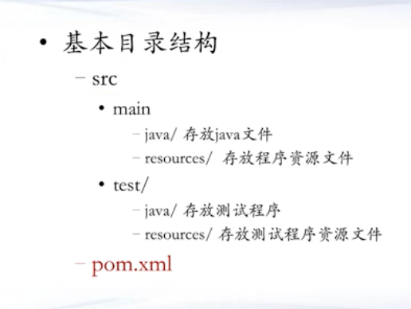

**问题**：希望有一种能够自动下载、管理jar包、又能够配置`buid path`的工具。
maven方法：

- 用maven创建一个项目
- 在[中央仓库](mvnrepository.com)中搜索需要的项目，在自己的项目中使用`import`
- maven编译和运行：选择`maven build`，maven会自动下载远程的jar包
- 最重要的过程是导入外部包！通过增加`<dependencies>`来进行包管理。
- `pom.xml`文件：
  - 项目信息
  - 依赖信息
  - 构建信息
- maven项目的目录结构：

